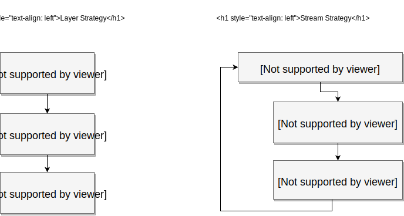

# ETL Framwork

Create simple imports with the [Extract, Transform, Load](https://en.wikipedia.org/wiki/Extract,_transform,_load) pattern.

## Installation

```sh
composer require camillebaronnet/php-etl
```

## Usage

```php
<?php

namespace App;

use Camillebaronnet\ETL\Extractor\Csv;
use Camillebaronnet\ETL\Strategy\LayerStrategy;
use Camillebaronnet\ETL\Transformer\DateTime;
use Camillebaronnet\ETL\Transformer\Trim;
use Camillebaronnet\ETL\Loader\Json;

//...

$etl = (new LayerStrategy)
    ->extract(Csv::class, ['filename' => 'dump.php'])
    ->transform(Trim::class)
    ->transform(DateTime::class, ['format' => 'd/m/Y', 'fields' => ['createAt']])
;

echo $etl->load(Json::class);

//...
```

## The different strategies



## Extendable

You can easily create your own custom Extractors,
Transformers, Loader or Strategy by implementing the corresponding interface.

- [ExtractInterface](src/Extractor/ExtractInterface.php)
- [TransformInterface](src/Transformer/TransformInterface.php)
- [LoaderInterface](src/Loader/LoaderInterface.php), if you're using the LayerStrategy.
- [StreamLoaderInterface](src/Loader/StreamLoaderInterface.php), if you're using the StreamStrategy.

You also can create a custom Strategy by implementing the [ETLInterface](src/ETLInterface.php).
